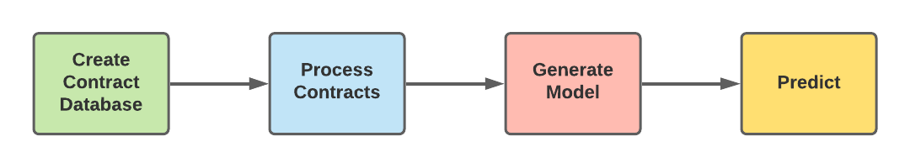
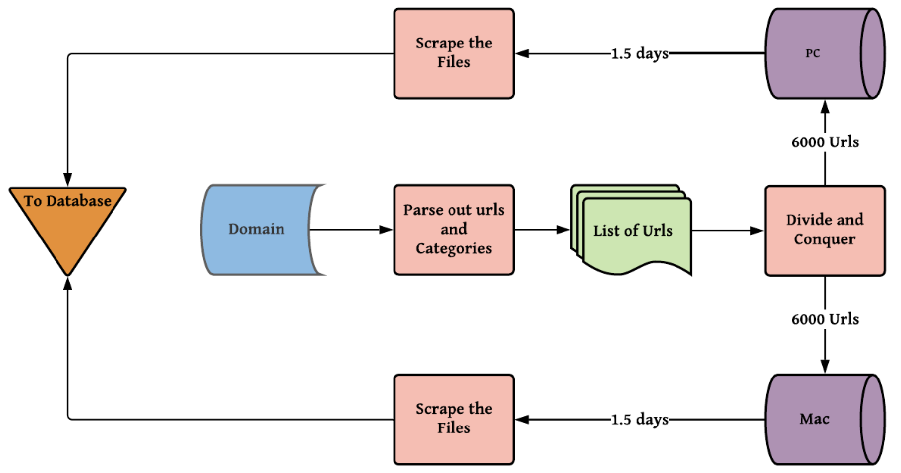
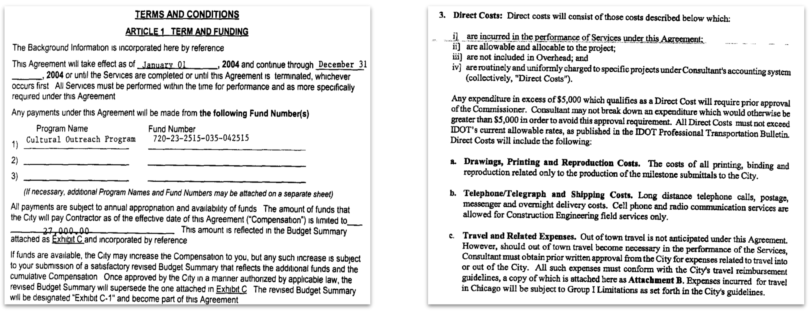
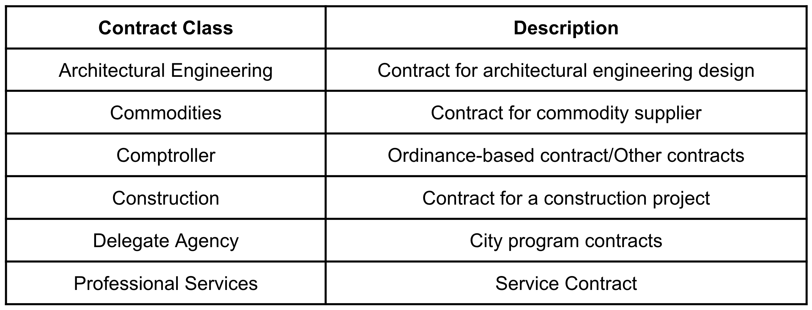
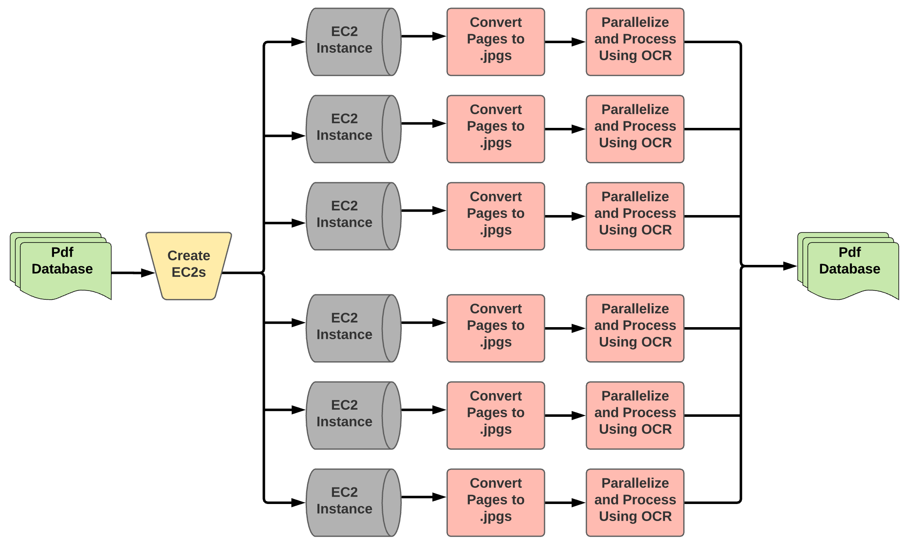
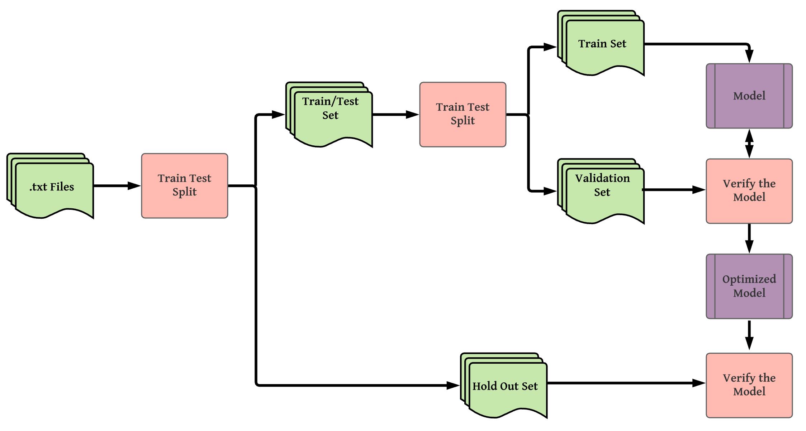
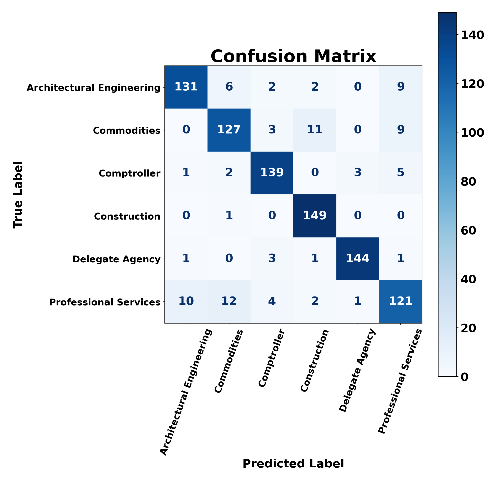

 
 
 
 

# Contract Identification and Filtration

## Introduction

For normal everyday people, reading contracts is not the most appealing endeavor and we deal with them on a regular basis.  Whether it's agreeing to a new update on your smart phone or signing all of the documents when closing on a new home, few of us actually read through the contract to ensure we are not signing our lives away.  The ultimate goal of this project is to distinguish the important parts of a contract from the rest.

## Process

 

### Creating the Database

Contracts are typically private documents and therefore obtaining enough contracts to genereate a model was no easy task.  I obtained all of my contracts for this model from the City of Chicago portal (https://data.cityofchicago.org).  Below is the workflow used to obtain these documents
 

 

### Processing the Contracts

These contracts came in as mostly scanned pdfs, so in order to process them I used Optical Character Recognition (OCR).  Below is an example of of the types of .pdf files that I obtained.  
 

 

### The Six Contract Classifications
 

 

OCR is computationally expensive so in order to optimize my time, I used cloud computing on AWS.  I split the 3600 pdfs I was going to use for the model evenly between six m5a.8xlarge EC2 instances.  Each instance generated a .jpg image file for each page of the .pdf files. I then split these .jpg images onto the 32 cores and used OCR to process the images individually in order to reduce processing time.  These returned individual .txt files for each image, which I combined to create one .txt file for the original .pdf.  The process flow for this is displayed in the image below.

### Generating the models

In order to generate the models, I needed to perform a proper train-test-split, stratifying the text files from each class evenly, utilizing the folders as class names and generating new folders for the train, validate, and holdout sets.  I ended up with 337 train documents, 113 test documents, and 150 holdout documents.  The workflow for this is highlighted below.

## Naive Bayes Classifier

I started off by using a Naive Bayes Classifier model.  The initial model, using a 1-gram to generate the tfidf matrix gave an accuracy score of 86.2% and after tuning the model by removing common words and using a 4-gram grouping the model achieved an accruacy of 90.1%.

 
 
 

### Class Report | Single Word
|           |   Architectural Engineering |   Commodities |   Comptroller |   Construction |   Delegate Agency |   Professional Services |   accuracy |   macro avg |   weighted avg |
|:----------|----------------------------:|--------------:|--------------:|---------------:|------------------:|------------------------:|-----------:|------------:|---------------:|
| precision |                    0.834395 |      0.953271 |      0.962121 |       0.922581 |          0.953642 |                0.651515 |   0.862222 |    0.879588 |       0.879588 |
| recall    |                    0.873333 |      0.68     |      0.846667 |       0.953333 |          0.96     |                0.86     |   0.862222 |    0.862222 |       0.862222 |
| f1-score  |                    0.85342  |      0.793774 |      0.900709 |       0.937705 |          0.956811 |                0.741379 |   0.862222 |    0.863966 |       0.863966 |
| support   |                  150        |    150        |    150        |     150        |        150        |              150        |   0.862222 |  900        |     900        |

 
 
 

### Class Report | 4 Words
|           |   Architectural Engineering |   Commodities |   Comptroller |   Construction |   Delegate Agency |   Professional Services |   accuracy |   macro avg |   weighted avg |
|:----------|----------------------------:|--------------:|--------------:|---------------:|------------------:|------------------------:|-----------:|------------:|---------------:|
| precision |                    0.916084 |      0.858108 |      0.92053  |       0.90303  |          0.972973 |                0.834483 |   0.901111 |    0.900868 |       0.900868 |
| recall    |                    0.873333 |      0.846667 |      0.926667 |       0.993333 |          0.96     |                0.806667 |   0.901111 |    0.901111 |       0.901111 |
| f1-score  |                    0.894198 |      0.852349 |      0.923588 |       0.946032 |          0.966443 |                0.820339 |   0.901111 |    0.900491 |       0.900491 |
| support   |                  150        |    150        |    150        |     150        |        150        |              150        |   0.901111 |  900        |     900        |

 
 

Below is the confusion matrix showing predictions generated from the 4-gram model.
 

 

## Random Forest

Next I tried a Random Forest model to potentially improve the accuracy of the model. The baseline accuracy was only 38%, but after adding the predictions from the Naive Bayes model and using a 4-gram word grouping for the tfidf matrix, the accuracy improved to 83%.  

## Future Work

1. Improve the dataset to include more relevant contracts
2. Work on highlighting important contract features
3. Web app
4. Utilize unsupervized learning for topic modeling